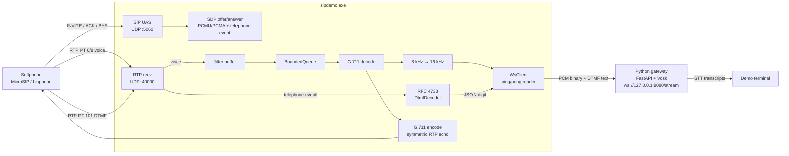
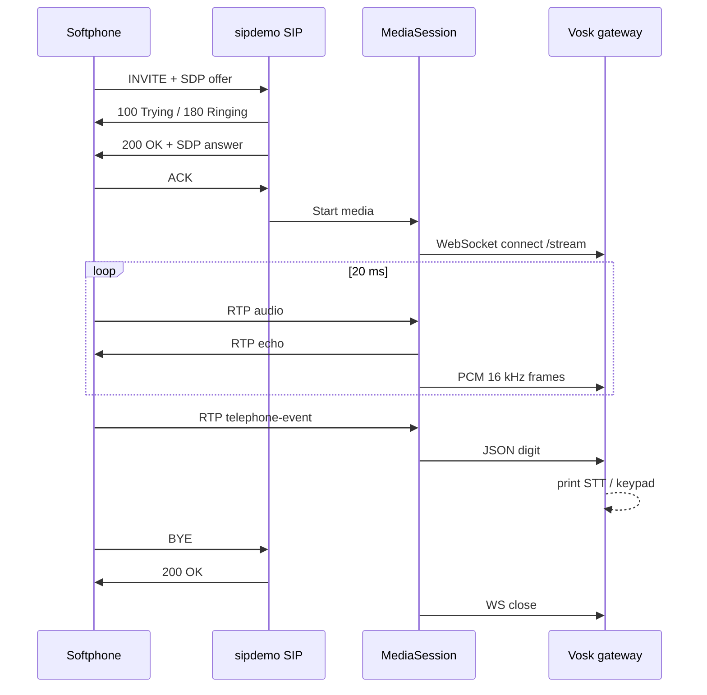

# sipdemo — a hand-written SIP/RTP endpoint (C++17)

A weekend-sized, **fully self-written** VoIP endpoint for interview prep covering
both **C++ depth** and **VoIP/SIP knowledge**. No PJSIP, no external SIP/RTP
libraries — every component is yours to explain and whiteboard.

It implements:

- a minimal **SIP UAS** (RFC 3261 subset): INVITE / ACK / BYE / OPTIONS / CANCEL,
- **SDP** offer/answer (RFC 4566 / 3264) for G.711 + **telephone-event** (DTMF),
- an **RTP** header parser/serializer (RFC 3550) with sequence wraparound,
- a **jitter buffer** (reorder / late / lost handling, depth knob),
- a thread-safe **bounded queue** (blocking + non-blocking),
- the **G.711** µ-law / A-law codec + 8→16 kHz upsample,
- **RFC 4733 DTMF** decode (out-of-band keypad → JSON),
- a minimal **WebSocket client** streaming PCM to a local AI gateway,
- **RtpStats** (loss %, reorder, RFC 3550 interarrival jitter),
- a **chaos RTP sender** (`rtp_sender`) that injects loss / reorder / delay.

Direct IP-to-IP: point a softphone straight at the endpoint. No registrar, no auth.

## High-level design



### Call + media sequence



### Threading inside `MediaSession`

| Thread | Job |
|--------|-----|
| main | SIP UDP + stats panel |
| rtp-recv | Parse RTP, latch symmetric peer, DTMF vs voice branch |
| playout | Pace jitter buffer at 20 ms → queue |
| output | Decode → STT fork → echo encode/send |
| WsClient reader | Drain server frames, answer ping/pong ([ISSUE-001](docs/ISSUES.md#issue-001--websocket-receive-buffer-never-drained-stt-dies-mid-call)) |

Design intent: **RTP path never blocks on Vosk**. AI sits behind a WebSocket; if the gateway is down, the call and echo continue.

## Layout

```
sipdemo/
  CMakeLists.txt
  include/sipdemo/*.h
  src/...
  gateway/                 # Python FastAPI + Vosk STT
  scripts/build.ps1        # MSVC configure + build (+ optional -Test)
  scripts/test.ps1         # build sipdemo_tests + ctest
  scripts/run-demo.ps1     # one-shot start/stop for local demo
  tests/*.cpp
  CLAUDE.md                # project/component map for agents
  tasks/todo.md            # improver-loop milestone tracker
  tasks/lessons.md         # improver-loop failure lessons
  .cursor/rules/           # Cursor agent rules
  .cursor/skills/          # project skills (e.g. automated-improver)
```

## Build (Windows native — primary path)

Install once:

```powershell
winget install -e --id Microsoft.VisualStudio.2022.BuildTools
# In the installer, enable "Desktop development with C++"
winget install -e --id Kitware.CMake
# Python 3 from python.org or:
winget install -e --id Python.Python.3.12
```

Then from a **Developer PowerShell for VS 2022**:

```powershell
cd C:\Users\Admin\Docs\C++\sipdemo
cmake -S . -B build
cmake --build build --config RelWithDebInfo
ctest --test-dir build -C RelWithDebInfo --output-on-failure
```

Binaries land in `build\RelWithDebInfo\sipdemo.exe` (and `rtp_sender.exe`).

### Optional: WSL

Same code builds with `apt install build-essential cmake` and Unix-style
`cmake --build`. Softphone-on-Windows + server-in-WSL needs the WSL eth0 IP
under default NAT (see older notes below). Prefer native Windows for demos.

## AI gateway (Vosk STT)

```powershell
cd gateway
python -m venv .venv
.\.venv\Scripts\Activate.ps1
pip install -r requirements.txt

# Download ~40 MB model:
#   https://alphacephei.com/vosk/models/vosk-model-small-en-us-0.15.zip
# Unzip, then either set:
$env:VOSK_MODEL_PATH = "$PWD\vosk-model-small-en-us-0.15"
# or place model files under gateway\model\ (see model\README.md)

uvicorn app:app --host 127.0.0.1 --port 8080
```

## Scripts

```powershell
cd C:\Users\Admin\Docs\C++\sipdemo

# Build (MSVC + CMake). Add -Test to run unit tests; -Clean to reconfigure.
powershell -ExecutionPolicy Bypass -File .\scripts\build.ps1
powershell -ExecutionPolicy Bypass -File .\scripts\build.ps1 -Test

# Run unit tests only (builds sipdemo_tests if needed, then ctest).
powershell -ExecutionPolicy Bypass -File .\scripts\test.ps1
powershell -ExecutionPolicy Bypass -File .\scripts\test.ps1 -Filter Dtmf

# Start Vosk gateway + sipdemo; Ctrl+C stops both.
powershell -ExecutionPolicy Bypass -File .\scripts\run-demo.ps1
```

### Tests (CMake / CTest)

GoogleTest is fetched by CMake (`SIPDEMO_BUILD_TESTS=ON`, default). Suites live
under `tests/` (SIP, SDP, RTP, jitter, queue, G.711, DTMF, resample).

```powershell
# After configure:
cmake --build build --config RelWithDebInfo --target sipdemo_tests
ctest --test-dir build -C RelWithDebInfo --output-on-failure

# Or the custom target:
cmake --build build --config RelWithDebInfo --target check
```

On single-config generators (Ninja/Make): `cmake --build build --target check`
or `ctest --test-dir build --output-on-failure`.

Then dial `sip:127.0.0.1` from MicroSIP (SIP defaults to port 5060).  
Avoid `sip:127.0.0.1:5060` in MicroSIP — that form often fails to dial; use the host-only URI instead.

`run-demo.ps1` needs `build\RelWithDebInfo\sipdemo.exe`, `gateway\.venv`, and the Vosk model under `gateway\vosk-model-small-en-us-0.15`.

## End-to-end demo (all on Windows)

**Option A — script (recommended):** see [Scripts](#scripts) above.

**Option B — two terminals**

**Terminal 1** — AI gateway (venv activated):

```powershell
$env:VOSK_MODEL_PATH = "$PWD\vosk-model-small-en-us-0.15"
$env:PYTHONUNBUFFERED = "1"
uvicorn app:app --host 127.0.0.1 --port 8080
```

**Terminal 2** — media server:

```powershell
.\build\RelWithDebInfo\sipdemo.exe --ip 127.0.0.1 --sip-port 5060 --rtp-port 40000 `
  --ws-url ws://127.0.0.1:8080/stream
```

**Softphone** (MicroSIP / Linphone / Zoiper) — dial `sip:127.0.0.1`  
(MicroSIP: prefer without `:5060`; 5060 is the default SIP port.)

You should hear yourself (echo), see `[STT TRANSCRIPT]` / `[STT PARTIAL]` in the
gateway terminal as you speak, and see `[KEYPAD INTERCEPTED]` when you press a
dial-pad key (RFC 4733).

### Chaos RTP-only demo (no softphone)

```powershell
.\build\RelWithDebInfo\sipdemo.exe --ip 127.0.0.1 --sip-port 5060 --rtp-port 40000
.\build\RelWithDebInfo\rtp_sender.exe --dest 127.0.0.1:40000 --secs 15 --loss 5 --reorder 5 --delay 40
```

## Scope (and deliberate non-scope)

In: minimal UAS, direct IP-to-IP, INVITE/ACK/BYE/OPTIONS/CANCEL, duplicate
absorption, SDP offer/answer, G.711, telephone-event DTMF, WebSocket PCM fork,
local Vosk STT.

Out (be ready to explain *why*): REGISTER/auth, TCP/TLS, forking, 100rel,
re-INVITE, Record-Route, full Timer A–K retransmission machinery, multi-call,
TTS / real LLM replies.

See [`docs/talking_points.md`](docs/talking_points.md) for component whiteboard notes,
[`docs/ISSUES.md`](docs/ISSUES.md) for numbered postmortems (WS buffer drain,
connect/reader deadlock, Windows UDP reset), and
[`docs/PERFORMANCE.md`](docs/PERFORMANCE.md) for the optimization backlog
(SIMD, lock-free media path, RT priority, benchmarking, select vs epoll).
